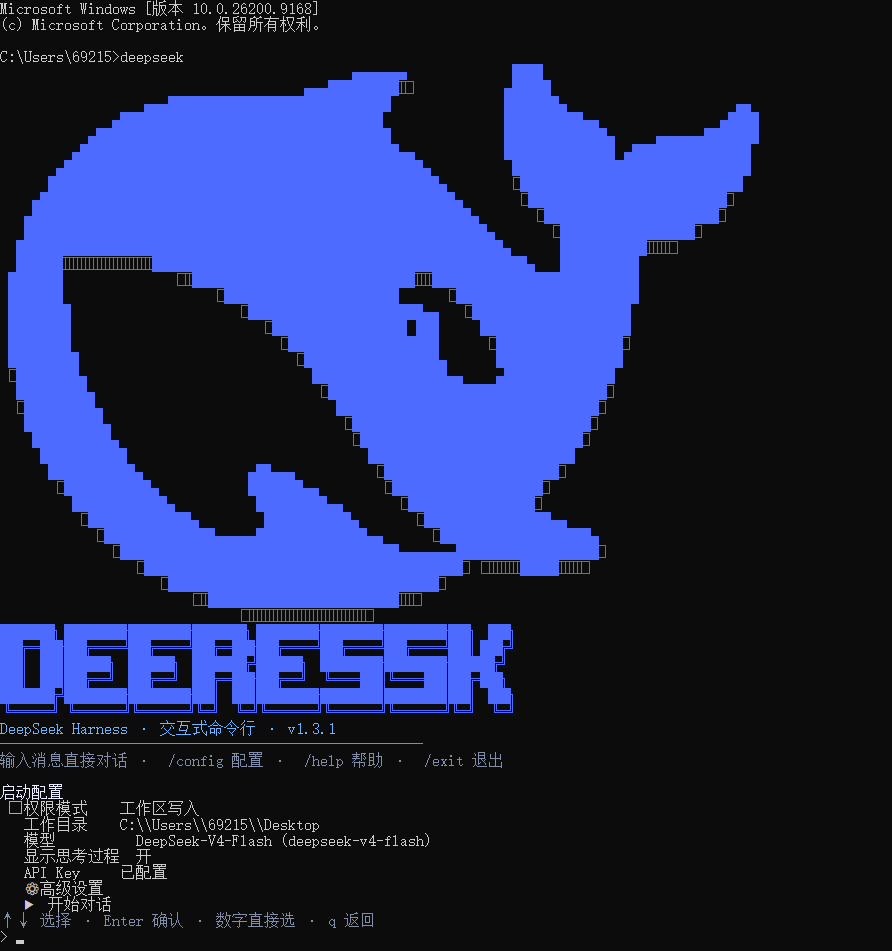

<div align="center">

# 🐋 DeepSeek CLI

**命令行里的 DeepSeek Agent** — 把 DeepSeek V4 装进你的终端：Codex / Claude Code 风格的配置向导、权限与工作区管理、Agent 预设与 Skill 扩展、中英文双语界面、流式对话。构建于 [DeepSeek Harness](https://github.com/deepseek-ai/deepseek-harness)。

> ⚠️ **非官方社区项目**：本工具由社区开发者独立构建，与 DeepSeek（深度求索）无关联、未经其认可或赞助。
> *Unofficial community project — not affiliated with, endorsed by, or sponsored by DeepSeek.*

**v1.3.1** 🎉

[](https://github.com/jincheng3870682453-hash/DeepSeek-CLI)
[](https://github.com/jincheng3870682453-hash/DeepSeek-CLI/actions/workflows/test.yml)
[](LICENSE)
[](https://github.com/deepseek-ai/deepseek-harness)
[](https://github.com/deepseek-ai/deepseek-harness)
[](https://www.deepseek.com)

> 🐋 终端启动画面（DeepSeek 大鲸鱼 ASCII 艺术）单独存放在 [`assets/whale.txt`](assets/whale.txt)，
> 避免在 GitHub 网页上占用大幅版面。


</div>

---

## ✨ 功能特性

| | | |
|---|---|---|
| 🎮 **方向键配置向导** | 🛡️ **权限模式** | 🔑 **首次使用引导** |
| ↑↓ 导航菜单（Codex 风格），自动探测终端能力 | 只读 / 工作区写入 / 完全访问，实时切换 | 自动检测并引导配置 API Key（隐藏输入） |
| 📂 **工作区管理** | 🧠 **模型选择** | 📋 **多行粘贴** |
| 当前目录 / 历史记录 / 自定义路径 | 多 provider 模型（Flash / Pro） | 粘贴整段代码自动合并为一条消息 |
| 🎯 **思考强度** | 🤖 **Agent 预设** | 🌐 **中英文界面** |
| off（快速）/ high / max 逐模型切换 | code / cordis / minimal / standard | `/lang` 或高级设置一键切换 |
| ⚙️ **繁忙时行为** | 🔌 **插件 & Skill 查看** | ⚡ **流式输出** |
| 排队发送 / 输入即打断当前回答 | `/plugins`、`/skills` 列出现有清单 | 边生成边显示，工具调用内联提示 |
| ⌨️ **完整 CLI 交互** | 🐋 **品牌启动画面** | | 
| Ctrl+C 中断/清行/退出，ESC 等同 | DeepSeek 大鲸鱼 logo + DEEPSEEK 大字 | |

---

## 🎬 演示

**真实终端运行画面**（点击图片可查看大图）：

<p align="center">
  
</p>

**配置向导动态演示**（SVG 动画：菜单光标上下移动、输入光标闪烁）：


---

## 🎯 项目定位

### 为什么做这个？

官方 [DeepSeek Harness](https://github.com/deepseek-ai/deepseek-harness) 提供的是 **Web 界面**（浏览器里配置模型、管理会话），但**缺少终端 CLI**——想不开浏览器、直接在一个 SSH 会话 / 服务器 / 终端窗口里用 DeepSeek Agent，就没有趁手的工具。

这个项目就是补上这一块：**把 DSH 引擎装进命令行**，做成 Codex / Claude Code 风格的终端工具——配置向导、权限管理、流式对话全在终端里完成，服务器上无浏览器也能用，还能管道接进 cron / CI 自动化。

### 项目形态

**纯命令行（纯后端）项目** — 无 Web 前端、无浏览器界面、无图形化 GUI。

与官方 [DeepSeek Harness](https://github.com/deepseek-ai/deepseek-harness) 共享同一套核心引擎
（Agent 循环、工具、沙箱、会话持久化），但只保留**终端交互层**：代码全部在这里
（`profiles/cli/`），克隆仓库即可审查、修改、构建。

```
DeepSeek Harness（核心引擎）──► DeepSeek CLI（本仓库，纯终端层）
   Agent 循环 / 工具 / 沙箱            └─ cli-runner：readline 交互 + 配置向导 + 流式输出
```

> 核心引擎 [deepseek-harness](https://github.com/deepseek-ai/deepseek-harness) 以 **MIT License** 开源（`Copyright (c) 2026 DeepSeek`），
> 本项目的 `cli-runner/` 终端交互层为原创代码，整体以 [AGPL-3.0-or-later](LICENSE) 发布。

---

## 🚀 快速开始

### ⚡ 一行安装（推荐 · 零依赖）

**连 Node.js 都不用装**——脚本会自动检测，缺什么自动下载（便携 Node → DSH 引擎 → 本仓库 → profile → 命令），一条命令全搞定。

**macOS / Linux / WSL**（终端里粘贴执行）：

```bash
curl -fsSL https://raw.githubusercontent.com/jincheng3870682453-hash/DeepSeek-CLI/master/install-oneliner.sh | bash
```

**Windows**（PowerShell 里粘贴执行）：

```powershell
irm https://raw.githubusercontent.com/jincheng3870682453-hash/DeepSeek-CLI/master/install-oneliner.ps1 | iex
```

> 脚本自动完成：① 检测/下载 Node.js（系统没有就自动装便携版到 `~/.deepseek-cli` 或 `%LOCALAPPDATA%\DeepSeek-CLI`）→ ② 安装 DSH 引擎 → ③ 拉取仓库 → ④ 装 profile → ⑤ 装 `deepseek` 命令。
> 装完新开终端输入 `deepseek` 即可，首次运行引导配置 API Key。
> 若下载失败（网络问题），改用下面的仓库安装方式。

### 方式一：GitHub 拉取安装

```powershell
# 1. 克隆本仓库
git clone https://github.com/jincheng3870682453-hash/DeepSeek-CLI.git
cd DeepSeek-CLI

# 2. 一键安装（复制 profile + 提示放置命令）
install.cmd
```

### 方式二：手动

```bat
:: 1. 复制 profile 到 DSH
xcopy /E /I /Y profiles\cli "%USERPROFILE%\.dsh\profiles\cli"

:: 2. 把 bin\deepseek.cmd / deepseek.ps1 放到 PATH 目录，新开终端
```

### 前置条件

- **一行安装（推荐）**：什么都不用装——脚本自动检测并下载 Node.js、安装 DSH 引擎、拉取本仓库、装 profile、装命令，一条命令全搞定（见上方「⚡ 一行安装」）。
- **手动安装**：才需要自己先装 [DeepSeek Harness](https://github.com/deepseek-ai/deepseek-harness)（`dsh` 命令可用），再按下面的「方式一 / 方式二」操作。
- DeepSeek API Key（首次运行自动引导配置；一行安装和手动安装都适用）

> ### 🛡️ 引擎版本兼容性
>
> 本 CLI 基于 **`@deepseek-ai/dsh` 0.1.x**（开发验证版本 `0.1.0-rc.6`）开发。
> 一行安装脚本（`install-oneliner.sh` / `.ps1`）会自动校验 `dsh --version`：
> 检测到主版本不一致时给出提示，并建议安装匹配版本
> `npm install -g @deepseek-ai/dsh@0.1.0-rc.6`。
> 手工安装的用户也可随时用 `dsh --version` 自查。

### 使用

```powershell
deepseek            # 启动（等同 dsh --profile cli）
```

首次运行会引导配置 API Key；之后进入配置向导，`↑↓` 选择后 `Enter` 确认即可开始对话。

### 🤖 脚本化 / 自动化

```powershell
# 非交互：跳过向导，管道输入即任务，EOF 自动退出（适合 cron / CI / 日志处理）
tail -f error.log | deepseek --no-input "分析并修复上面的错误"
echo "翻译这段：hello" | deepseek --no-input "把输入翻译成中文"

# 调试：输出回合耗时 / token 消耗 / 工具调用
deepseek --verbose

# 代理：自动读取 HTTP_PROXY / HTTPS_PROXY 环境变量（无需额外参数）
export HTTPS_PROXY=http://proxy.internal:8080
deepseek
```

### 🚀 启动参数

| 参数 | 作用 |
|---|---|
| `--no-input`（`-n`） | 非交互：跳过配置向导，管道输入即任务，EOF 自动退出（适合 cron / CI） |
| `--verbose`（`--debug` / `-v`） | 每回合结束打印耗时 / token 消耗 / 工具调用次数 |
| `--auto-fix` | 预留：允许 Agent 自动修复（配合非交互使用） |

```powershell
deepseek --no-input "分析并修复 error.log 里的错误"
deepseek --verbose
tail -f app.log | deepseek --no-input -v "发现异常就总结"
```

### 🌐 环境变量

| 变量 | 作用 |
|---|---|
| `DSH_HOME` | 数据目录（默认 `~/.dsh`）：配置文件、会话、日志、凭据都在这里 |
| `HTTP_PROXY` / `HTTPS_PROXY` | 代理地址，自动生效（无需参数），如 `http://proxy.internal:8080` |
| `DEEPSEEK_CLI_HOME` | 一行安装器的安装目录（默认 `~/.deepseek-cli` 或 `%LOCALAPPDATA%\DeepSeek-CLI`） |

---

## 🎮 交互

### 配置向导

```
启动配置
 ❯ 权限模式      工作区写入           ← 光标在此
   工作目录      C:\Users\69215\Desktop
   模型          DeepSeek-V4-Flash
   显示思考过程  关
   API Key      已配置
   ▶ 开始对话
↑↓ 选择 · Enter 确认 · 数字直接选 · q 返回
```

### 对话命令

| 命令 | 语法 | 说明 |
|---|---|---|
| `/config` | `/config` | 重新打开配置向导 |
| `/mode` | `/mode`<br>`/mode <模式>` | 无参：显示当前权限模式与可选列表；带参：切换（`read-only` / `workspace-write` / `danger-full-access`），如 `/mode read-only` |
| `/cd` | `/cd`<br>`/cd <路径>` | 无参：显示当前工作目录与用法；带参：切换（支持 `~`、相对/绝对路径），如 `/cd ~/projects` |
| `/model` | `/model`<br>`/model <id>`<br>`/model list` | 无参：显示当前模型；`list` 或 `?`：列出当前 provider 全部模型；带参：直接切换，如 `/model deepseek-v4-flash` |
| `/think` | `/think [on\|off]` | 切换思考过程显示；可带 `on` / `off` / `1` / `0` |
| `/effort` | `/effort`<br>`/effort <off\|high\|max>` | 无参：显示当前；带参：切换思考强度（`off` 快速 / `high` / `max`） |
| `/preset` | `/preset`<br>`/preset <id>`<br>`/preset new <名称>` | 无参：显示当前预设、自定义目录与示例结构；带参：切换（`code` / `cordis` / `minimal` / `standard` 或自定义）；`new`：从 standard 复制创建自定义预设 |
| `/lang` | `/lang [zh\|en]` | 无参：显示当前语言；带参：切换界面语言 |
| `/busy` | `/busy [queue\|interrupt]` | 无参：显示当前行为；带参：切换（`queue` 排队发送 / `interrupt` 输入即打断当前回答） |
| `/plugins` | `/plugins` | 列出已加载插件 |
| `/skills` | `/skills`<br>`/skills new <名称>` | 列出可用 Skill 与自定义目录；`new`：在 `$DSH_HOME/skills/<名称>/` 创建 SKILL.md 模板 |
| `/new` | `/new` | 开启新会话（旧会话保留在 `$DSH_HOME/sessions/`） |
| `/help` | `/help`（或 `/h`） | 显示帮助 |
| `/exit` | `/exit`（或 `/quit` / `/q`） | 退出（`Ctrl+C` 空输入也行） |

### 按键

| 按键 | 行为 |
|---|---|
| `↑` / `↓` + `Enter` | 菜单导航（方向键；不支持时自动降级数字输入） |
| `Ctrl+C`（回答中） | 中断回答，立即回到提示符 |
| `Ctrl+C`（输入中） | 清空当前输入行 |
| `Ctrl+C`（空输入） | 退出 |
| `Esc` | 同 `Ctrl+C` |
| 多行粘贴 | 自动合并为一条消息 |

---

## 🧩 目录结构

```
DeepSeek-CLI/
├── install.cmd / install.sh     # 一键安装（Windows / Linux-macOS）
├── install-oneliner.sh / .ps1   # 一行安装（零依赖，含 dsh 版本校验）
├── package.json                 # 开发依赖（vitest 单元测试）
├── test/                        # 单元测试（vitest，55 用例）
│   ├── utils.test.js            # i18n / CJK 宽度 / 路径 / 脱敏
│   ├── config.test.js           # 设置与凭据读写
│   ├── commands.test.js         # 命令解析
│   └── menu.test.js             # 菜单导航状态机
├── profiles/
│   └── cli/             # dsh cli profile
│       ├── package.json
│       ├── cordis.yml
│       ├── cordis.patch.yml
│       ├── pnpm-workspace.yaml
│       └── cli-runner/
│           ├── index.js  # 交互式 runner（菜单 / 命令 / 会话）
│           ├── utils.js  # i18n 字典、CJK 宽度、路径/目录辅助
│           ├── config.js # 设置与凭据读写（cli-settings.json / .credentials.yaml）
│           ├── menu.js   # 方向键菜单控制器（渲染 + 导航状态机）
│           └── commands.js # 命令解析纯函数（输入 → {cmd, arg, rest}）
└── bin/                 # 启动命令
    ├── deepseek.cmd / .ps1 / (bash)  # 主命令
    ├── dsh-chat.cmd / .ps1   # 兼容别名
    └── dsh-ask.cmd / .ps1    # 一次性问答
```

**运行时数据目录（`$DSH_HOME`，默认 `~/.dsh`）**——所有用户数据都在这，不在仓库里：

```
~/.dsh/
├── cli-settings.json      # CLI 用户偏好（权限/目录/模型/语言…）
├── .credentials.yaml      # API Key（与 DSH 网页版共用，绝不提交 git）
├── app-debug.log          # 引擎运行日志
├── app-dsh-out.log        # 引擎标准输出
├── app-dsh-err.log        # 引擎错误输出
├── sessions/              # 会话历史（一个会话一个文件）
├── skills/                # 自定义 Skill（<名称>/SKILL.md）
├── .agent-presets/        # 自定义预设（<id>/agent.cordis.yml）
├── storages/              # 引擎存储
└── profiles/cli/          # 本 CLI 的 profile（源码来自本仓库）
```

---

## 💻 跨平台支持

| 平台 | 支持 | 启动 |
|---|---|---|
| **Windows** | ✅ 完整支持 | `deepseek`（`.cmd` / `.ps1`） |
| **Linux** | ✅ 完整支持 | `bin/deepseek`（bash 脚本） |
| **macOS** | ✅ 预期可用 | `bin/deepseek`（bash 脚本） |
| **WSL** | ✅ 支持 | `bin/deepseek` |

**Linux / macOS 安装**：

```bash
# 1. 安装 DeepSeek Harness（提供 dsh 命令）
npm install -g @deepseek-ai/dsh

# 2. 安装本仓库
git clone https://github.com/jincheng3870682453-hash/DeepSeek-CLI.git
cd DeepSeek-CLI
./install.sh          # 复制 profile + 安装 deepseek 命令

# 3. 启动
deepseek
```

核心逻辑（`cli-runner/`：`index.js` / `utils.js` / `config.js`）使用 Node 跨平台 API（readline / fs / path），
路径统一用 `path.join` 处理，配置文件都在 `$DSH_HOME`（Linux 默认 `~/.dsh`），
Windows 与 Linux 行为一致。

---

## 🗂️ 两种配置，各司其职

本项目有两类配置文件，**职责完全不同，别搞混**：

| 文件 | 属于谁 | 内容 | 能不能改 |
|---|---|---|---|
| `profiles/cli/cordis.yml`（+ `cordis.patch.yml`） | **DSH 引擎** | 声明 profile 的插件装配（bundle、runtime、插件列表），由 DSH 的 loader 强制解析 | ❌ **不能改格式**——这是 DSH 引擎的约定，改了可能启动失败 |
| `$DSH_HOME/cli-settings.json` | **本 CLI 自己** | 权限模式 / 工作目录 / 模型 / 思考显示 / 语言等用户偏好 | ✅ 随便改（或直接在向导里调，等价） |

> **一句话**：`cordis.yml` 是"这台引擎装了什么插件"的装配清单（DSH 管）；`cli-settings.json` 是"我这个用户喜欢什么配置"的偏好文件（CLI 管）。
> 想改 UI/行为 → 改 `cli-settings.json` 或运行向导；想改插件装配 → 才碰 `cordis.yml`。

## 📋 日志与调试

**① 运行中实时调试**（每回合结束自动打印耗时 / token / 工具调用）：

```powershell
deepseek --verbose        # 或 --debug（等价）
```

```
[debug] 回合耗时 0.76s · prompt 97 tok · output 33 tok · cache-read 8192
```

**② DSH 引擎日志**（写在 `$DSH_HOME` 下，记录服务启动、端口、异常）：

| 文件 | 内容 |
|---|---|
| `app-debug.log` | 引擎运行日志：服务启动、spawn pid、端口检查 |
| `app-dsh-out.log` | 引擎标准输出（如 `dsh web: http://127.0.0.1:3080`） |
| `app-dsh-err.log` | 引擎错误输出（出问题**优先看这个**） |

cmd 查看：

```cmd
type %USERPROFILE%\.dsh\app-debug.log
```

PowerShell 实时滚动查看（新日志自动刷出，`Ctrl+C` 退出）：

```powershell
Get-Content $env:USERPROFILE\.dsh\app-debug.log -Tail 30 -Wait
```

**③ 会话记录**：每次对话的完整内容保存在 `$DSH_HOME\sessions\`（一个会话一个文件），随时可翻历史。

> **故障排查顺序**：先 `deepseek --verbose` 看回合是否正常 → 引擎报错看 `app-dsh-err.log` → 启动异常看 `app-debug.log` 尾部。

## 🧩 自定义 Skill

Skill = 给 Agent 的"技能说明书"。放一个目录即可，**不用改代码**：

```
$DSH_HOME/skills/
└── my-skill/
    └── SKILL.md          # 技能内容（markdown 头部带 name/description）
```

**操作：**

```powershell
deepseek
/skills              # 查看已有 Skill 和自定义目录位置
/skills new my-skill # 自动创建模板 $DSH_HOME\skills\my-skill\SKILL.md，改内容即可
```

模板（`SKILL.md`）：

```markdown
---
name: my-skill
description: 描述这个 skill 的用途（一行）
---
在这里编写 skill 的指令内容。模型调用此 skill 时会看到这里的内容。
```

## 🤖 自定义 Agent 预设

预设 = 人设 + 工具组合。放 `$DSH_HOME/.agent-presets/<id>/agent.cordis.yml`：

```
$DSH_HOME/.agent-presets/
└── my-agent/
    └── agent.cordis.yml   # 自定义人设/工具
```

**操作：**

```powershell
deepseek
/preset              # 查看已有预设和自定义目录位置
/preset new my-agent # 从 standard 复制一份起步，再改内容
/preset my-agent     # 切换到你的预设
```

## 💬 会话管理

| 操作 | 方法 |
|---|---|
| 开启新会话 | `/new`（旧会话自动保存） |
| 查看历史会话 | `dir %USERPROFILE%\.dsh\sessions`（PowerShell：`Get-ChildItem $env:USERPROFILE\.dsh\sessions`） |
| 清空全部历史 | `del %USERPROFILE%\.dsh\sessions\*`（PowerShell：`Remove-Item $env:USERPROFILE\.dsh\sessions\* -Recurse -Force`） |

## 🗑️ 卸载与清理

```powershell
# 1. 删除启动命令（deepseek / dsh-chat / dsh-ask）
#    一行安装：删掉安装目录里的 deepseek.cmd / deepseek.ps1
#    或手动删除你当初放到 PATH 的 bin\deepseek.* 文件

# 2. 删除 CLI profile
Remove-Item "$env:USERPROFILE\.dsh\profiles\cli" -Recurse -Force

# 3. （可选）删除全部数据：配置、会话、日志、凭据
Remove-Item "$env:USERPROFILE\.dsh" -Recurse -Force
# ⚠️ 第 3 步会连 API Key（.credentials.yaml）一起删，确定不要了再执行
```

## 🔒 配置与安全

- **API Key**：`$DSH_HOME/.credentials.yaml`（与 DeepSeek Harness 网页版共用；**已被 .gitignore 排除，不会提交**）
- **用户设置**：`$DSH_HOME/cli-settings.json`（权限模式 / 工作目录 / 模型 / 思考显示，同样被排除；兼容 PowerShell 写入的 UTF-8 BOM）
- **会话历史**：`$DSH_HOME/sessions/`，持久化保存，随时 `/new` 开启新会话

---

## 📄 许可证

本项目采用 **GNU Affero General Public License v3 或更高版本（AGPL-3.0-or-later）**：[LICENSE](LICENSE)

> **一句话**：**随便用，但改过的代码也必须开源** —— 任何人修改、分发、或通过网络对外提供本软件（或其衍生版本）的服务，都必须以 AGPL 公开全部修改后的源码。
> 想"偷改两行就闭源拿去卖钱"？AGPL 就是为此设计的：改一行也得开源，闭源商用即侵权。
>
> - ✅ 允许：个人使用、学习、修改、分发（含收费分发，但必须同时提供源码）
> - ⚠️ 要求：任何修改/衍生作品必须同样以 AGPL 开源；通过网络提供服务的也要开放对应源码（第 13 条）
> - ❌ 禁止：闭源分发、闭源商用衍生品、增加额外限制条款

## 🤝 贡献

想参与开发？请看 [CONTRIBUTING.md](CONTRIBUTING.md) —— 纯代码项目，改动集中在 `cli-runner/`（`index.js` / `utils.js` / `config.js` / `menu.js` / `commands.js`），纯函数改完跑 `npm test`。
提交 PR 时请使用仓库内的 [PR 模板](.github/PULL_REQUEST_TEMPLATE.md)。

---

## 🏷️ 版本历史

### v1.3.1（2026-08）— 再拆一层 + CI 绿勾 + AGPL 协议

- 📦 **继续拆文件**：`cli-runner/index.js` 降至 **1060 行** —— 新增 `menu.js`（方向键菜单控制器：渲染 + 导航状态机，keypress 直接驱动、可独立单测）与 `commands.js`（命令解析纯函数 `parseCommand`）
- 🧪 **测试 55 个用例**：新增 `test/menu.test.js`（光标移动/环绕、Enter/ESC/数字键、吞行恰好一次、非 TTY 行为）与 `test/commands.test.js`（`/mode read-only` → 命令对象、路径带空格、非命令返回 null）
- 🟢 **CI 徽章**：GitHub Actions（`.github/workflows/test.yml`）push/PR 自动跑测试，README 顶部实时绿勾
- 📜 **开源协议 MIT → AGPL-3.0**：最强 copyleft——修改/分发/网络服务都必须开源全部衍生代码，防止"改两行拿去闭源卖钱"
- 📖 **完整操作手册**：README 补齐全部操作——对话命令完整语法/示例、启动参数（`--no-input`/`--verbose`/`--auto-fix`）、环境变量（`DSH_HOME`/代理）、自定义 Skill/Preset 操作、会话管理、日志查看、卸载清理、`$DSH_HOME` 数据目录结构
- 🧭 **文档理顺**：前置条件改为"一行安装自动处理 DSH / 手动安装才需先装引擎"；新增「为什么做这个」（官方 Harness 只有 Web 缺终端 CLI）；CONTRIBUTING 新增"加一个新命令"实战示例（改哪个文件、跑哪个测试）
- 🎨 **版面优化**：顶部 35 行鲸鱼 ASCII 艺术移至 [`assets/whale.txt`](assets/whale.txt)（终端启动画面不变），README 首屏更清爽
- 📸 **真实终端截图**：演示章节新增 [`assets/demo-terminal.png`](assets/demo-terminal.png)（892×951，仅 20KB，加载快），动态 SVG 演示保留在下
- ⚠️ **免责声明**：README 顶部新增中英双语"非官方社区项目"声明（与 DeepSeek 无关联、未经认可）；项目定位处标注 Harness 为 MIT（`Copyright (c) 2026 DeepSeek`），本仓库交互层原创、整体 AGPL 发布

### v1.3.0（2026-08）— 工程化重构

- 📦 **代码拆文件**：`cli-runner/index.js` 从 1955 行拆为 `index.js`（交互/会话/命令执行）+ `utils.js`（i18n 字典、CJK 宽度、路径与 skill/preset 目录辅助）+ `config.js`（设置与凭据读写）
- 🧪 **单元测试**：引入 vitest（35 用例：utils 25 + config 10），覆盖 i18n 占位替换、CJK 显示宽度、密钥脱敏、路径展开、设置 BOM/损坏容错、凭据读写；`npm test` 一键运行
- 🛡️ **DSH 版本标注**：README 标明基于 `@deepseek-ai/dsh` 0.1.x（`0.1.0-rc.6`）开发验证；`install-oneliner.sh/.ps1` 安装时自动校验 `dsh --version` 主版本并提示匹配版本
- 🗂️ **配置格式说明**：README 新增「两种配置，各司其职」——`cordis.yml` 是 DSH 引擎装配清单（不能改格式），`cli-settings.json` 是 CLI 用户偏好（随便改）

### v1.2.0（2026-08）— 脚本化与运维

- 🚀 **`--no-input` 非交互模式**：跳过向导、管道输入即任务、EOF 自动退出（适合 `tail -f log | deepseek --no-input "修复错误"` 式自动化）
- 📊 **`--verbose` / `--debug`**：输出回合耗时、token 消耗（prompt/output/缓存）、工具调用次数
- 🌐 **代理自动适配**：检测 `HTTP_PROXY` / `HTTPS_PROXY` 环境变量，自动注入（企业内网友好）
- 📂 **skill/preset 目录引导**：`/skills`、`/preset` 直接显示示例目录结构，新手一看就懂

### v1.1.0（2026-08）— 跨平台兼容

- 🖥️ **全系统兼容性测试**（详见 [COMPATIBILITY.md](COMPATIBILITY.md)）：
  Windows 11 实测通过、Linux 脚本+静态验证通过、macOS 静态审查通过
- 🐧 新增 `bin/deepseek`（bash）与 `install.sh`，支持 Linux / macOS / WSL
- 🔧 路径统一 `path.join`（消除 Windows 反斜杠硬编码），代码无平台分支

### v1.0.0（2026-08）— 首个正式版

- 🐋 品牌启动画面（DeepSeek 大鲸鱼 logo + DEEPSEEK 大字 + 动态 SVG 演示）
- 🎮 方向键配置向导（自动探测终端能力，不支持时降级数字输入）
- 🔑 首次使用引导：自动检测并隐藏输入配置 API Key
- 🛡️ 权限模式（只读 / 工作区写入 / 完全访问，实时切换）
- 🧠 多 provider 模型选择 + 思考强度（off / high / max）
- 🤖 Agent 预设（标准 / PTC / 创造 / 极简 + 自定义），已汉化
- 📚 Skill 支持（目录加载 + `/skills new` 模板创建）
- 🌐 完整中英文双语界面（`/lang` 实时切换）
- ⚙️ 繁忙时行为（排队 / 输入即打断）、自定义目录、插件列表
- ⌨️ 完整 CLI 交互：Ctrl+C 中断/清行/退出、多行粘贴合并、配置持久化

---

<p align="center">Made with 🐋 by the DeepSeek community</p>
