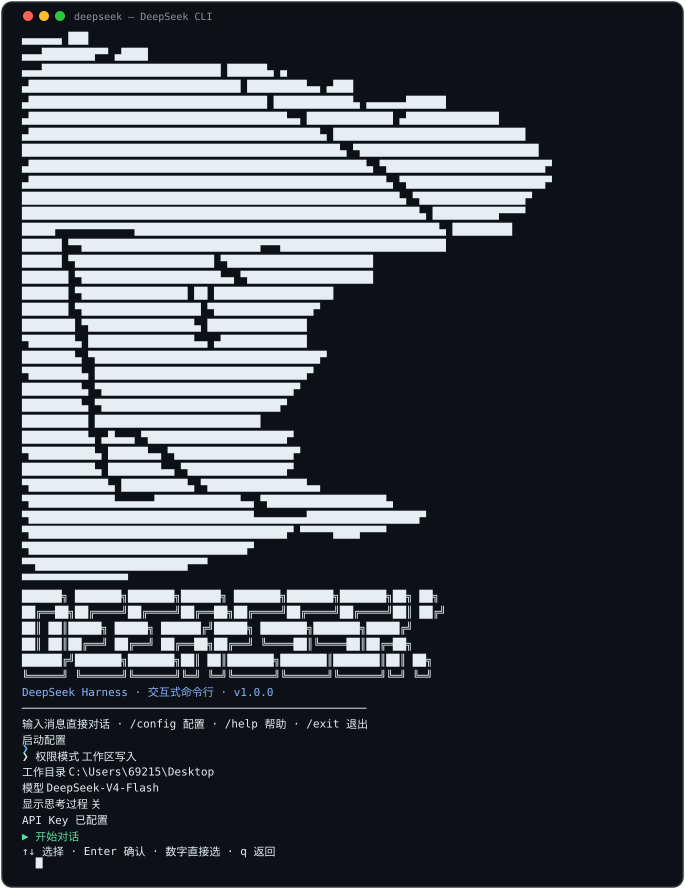

<div align="center">

# 🐋 DeepSeek CLI

**命令行里的 DeepSeek Agent** — 把 DeepSeek V4 装进你的终端：Codex / Claude Code 风格的配置向导、权限与工作区管理、Agent 预设与 Skill 扩展、中英文双语界面、流式对话。构建于 [DeepSeek Harness](https://github.com/deepseek-ai/deepseek-harness)。

**v1.0.0** 🎉

[](https://github.com/jincheng3870682453-hash/DeepSeek-CLI)
[](LICENSE)
[](https://github.com/deepseek-ai/deepseek-harness)
[](https://github.com/deepseek-ai/deepseek-harness)
[](https://www.deepseek.com)

```
                                            ▄▄▄▄▄▄              ███
                                      ▄▄▄████████▀▀            ▄████
                  ▄▄▄███████████████████████████               ██████▄                      ▄
              ▄████████████████████████████████                █████████▄▄                ▄███
           ▄████████████████████████████████████               ████████████▄      ▄▄▄▄▄▄██████
         ▄███████████████████████████████████████▄▄            █████████████  ▄██████████████
       ▄████████████████████████████████████████████▄           █████████████████████████████
      ████████████████████████████████████████████████▄         ▀███████████████████████████
    ▄███████████████████████████████████████████████████▄        ▀████████████████████████▀
   ▄██████████████████████████████████████████████████████▄        ▀█████████████████████▀
   █████████████████████████████████████████████████████████▄        ▀████████████████▀
  ████████████████████████████████████████████████████████████▄       ██████████▀▀▀▀
  █████▀▀▀▀▀▀▀▀▀▀▀▀██████████████████████████████████████████████▄    █████████
 ██████               ▀▀███████████████████████████▀▀▀█████████████████████████
 ██████                    ▀█████████████████████       ▀██████████████████████
 ███████                      ▀█████████████████████▄▄    ▀███████████████████
 ███████                         ▀████████████████  ██      ██████████████████
 ███████                           ▀██████████████████       ▀███████████████▀
 ████████                            ▀████████████████▄       ███████████████
 ▀███████▄                             ████████████████▄▄     ▄█████████████
  ████████▄                             ▀██████████████████████████████████▀
  ▀████████▄                              ████████████████████████████████▀
   █████████▄                              ▀█████████████████████████████▀
    █████████▄                              ▀███████████████████████████▀
     ██████████                               █████████████████████████
      ██████████▄              ▄█▄▄▄           ▀█████████████████████▀
       ▀██████████▄            ██████▄▄         ▀██████████████████▀
         ███████████▄           ████████▄▄        ▀███████████████▀
          ▀████████████▄         ██████████▄        ▀███████████████▄▄
            ▀█████████████▄▄▄▄▄▄█████████████▄▄       ▀██████████████████▄
              ▀██████████████████████████████████▄▄▄▄▄▄▄▄█████████████████▀
                 ▀███████████████████████████████████████▀  ▀▀▀▀▀████▀▀▀▀
                    ▀█████████████████████████████████▀
                        ▀▀███████████████████████▀▀▀
                              ▀▀▀▀▀▀▀▀▀▀▀▀▀▀▀▀
```

</div>

---

## ✨ 功能特性

| | | |
|---|---|---|
| 🎮 **方向键配置向导** | 🛡️ **权限模式** | 🔑 **首次使用引导** |
| ↑↓ 导航菜单（Codex 风格），自动探测终端能力 | 只读 / 工作区写入 / 完全访问，实时切换 | 自动检测并引导配置 API Key（隐藏输入） |
| 📂 **工作区管理** | 🧠 **模型选择** | 📋 **多行粘贴** |
| 当前目录 / 历史记录 / 自定义路径 | 多 provider 模型（Flash / Pro） | 粘贴整段代码自动合并为一条消息 |
| 🎯 **思考强度** | 🤖 **Agent 预设** | 🌐 **中英文界面** |
| off（快速）/ high / max 逐模型切换 | code / cordis / minimal / standard | `/lang` 或高级设置一键切换 |
| ⚙️ **繁忙时行为** | 🔌 **插件 & Skill 查看** | ⚡ **流式输出** |
| 排队发送 / 输入即打断当前回答 | `/plugins`、`/skills` 列出现有清单 | 边生成边显示，工具调用内联提示 |
| ⌨️ **完整 CLI 交互** | 🐋 **品牌启动画面** | | 
| Ctrl+C 中断/清行/退出，ESC 等同 | DeepSeek 大鲸鱼 logo + DEEPSEEK 大字 | |

---

## 🎬 演示

> 启动 → 配置向导（*终端窗口为动态 SVG：菜单光标上下移动、输入光标闪烁*）



---

## 🎯 项目定位

**纯命令行（纯后端）项目** — 无 Web 前端、无浏览器界面、无图形化 GUI。

与官方 [DeepSeek Harness](https://github.com/deepseek-ai/deepseek-harness) 共享同一套核心引擎
（Agent 循环、工具、沙箱、会话持久化），但只保留**终端交互层**：代码全部在这里
（`profiles/cli/`），克隆仓库即可审查、修改、构建。

```
DeepSeek Harness（核心引擎）──► DeepSeek CLI（本仓库，纯终端层）
   Agent 循环 / 工具 / 沙箱            └─ cli-runner：readline 交互 + 配置向导 + 流式输出
```

---

## 🚀 快速开始

### 方式一：GitHub 拉取安装（推荐）

```powershell
# 1. 克隆本仓库
git clone https://github.com/jincheng3870682453-hash/DeepSeek-CLI.git
cd DeepSeek-CLI

# 2. 一键安装（复制 profile + 提示放置命令）
install.cmd
```

### 方式二：手动

```bat
:: 1. 复制 profile 到 DSH
xcopy /E /I /Y profiles\cli "%USERPROFILE%\.dsh\profiles\cli"

:: 2. 把 bin\deepseek.cmd / deepseek.ps1 放到 PATH 目录，新开终端
```

### 前置条件

- 已安装 [DeepSeek Harness](https://github.com/deepseek-ai/deepseek-harness)（`dsh` 命令可用）
- DeepSeek API Key（首次运行自动引导配置）

### 使用

```powershell
deepseek            # 启动（等同 dsh --profile cli）
```

首次运行会引导配置 API Key；之后进入配置向导，`↑↓` 选择后 `Enter` 确认即可开始对话。

---

## 🎮 交互

### 配置向导

```
启动配置
 ❯ 权限模式      工作区写入           ← 光标在此
   工作目录      C:\Users\69215\Desktop
   模型          DeepSeek-V4-Flash
   显示思考过程  关
   API Key      已配置
   ▶ 开始对话
↑↓ 选择 · Enter 确认 · 数字直接选 · q 返回
```

### 对话命令

| 命令 | 作用 |
|---|---|
| `/config` | 打开配置向导 |
| `/mode` | 切换权限模式（只读 / 工作区写入 / 完全访问） |
| `/cd <路径>` | 切换工作目录 |
| `/model` | 切换模型（多 provider） |
| `/think` | 显示/隐藏思考过程 |
| `/effort` | 思考强度（off / high / max） |
| `/preset` | Agent 预设（code / cordis / minimal / standard） |
| `/lang` | 切换界面语言（zh / en） |
| `/busy` | 繁忙时行为（queue 排队 / interrupt 打断） |
| `/plugins` | 列出已加载插件 |
| `/skills` | 列出可用 Skill |
| `/new` | 开启新会话 |
| `/exit` | 退出 |

### 按键

| 按键 | 行为 |
|---|---|
| `↑` / `↓` + `Enter` | 菜单导航（方向键；不支持时自动降级数字输入） |
| `Ctrl+C`（回答中） | 中断回答，立即回到提示符 |
| `Ctrl+C`（输入中） | 清空当前输入行 |
| `Ctrl+C`（空输入） | 退出 |
| `Esc` | 同 `Ctrl+C` |
| 多行粘贴 | 自动合并为一条消息 |

---

## 🧩 目录结构

```
DeepSeek-CLI/
├── install.cmd          # 一键安装脚本
├── profiles/
│   └── cli/             # dsh cli profile
│       ├── package.json
│       ├── cordis.yml
│       ├── cordis.patch.yml
│       ├── pnpm-workspace.yaml
│       └── cli-runner/
│           └── index.js # 交互式 runner（核心逻辑）
└── bin/                 # 启动命令
    ├── deepseek.cmd / .ps1
    ├── dsh-chat.cmd / .ps1   # 兼容别名
    └── dsh-ask.cmd / .ps1    # 一次性问答
```

---

## 🔒 配置与安全

- **API Key**：`$DSH_HOME/.credentials.yaml`（与 DeepSeek Harness 网页版共用；**已被 .gitignore 排除，不会提交**）
- **用户设置**：`$DSH_HOME/cli-settings.json`（权限模式 / 工作目录 / 模型 / 思考显示，同样被排除）
- **会话历史**：`$DSH_HOME/sessions/`，持久化保存，随时 `/new` 开启新会话

---

## 📄 许可证

[MIT](LICENSE)

## 🤝 贡献

想参与开发？请看 [CONTRIBUTING.md](CONTRIBUTING.md) —— 纯代码项目，改动集中在 `cli-runner/index.js`。
提交 PR 时请使用仓库内的 [PR 模板](.github/PULL_REQUEST_TEMPLATE.md)。

---

## 🏷️ 版本历史

### v1.0.0（2026-08）— 首个正式版

- 🐋 品牌启动画面（DeepSeek 大鲸鱼 logo + DEEPSEEK 大字 + 动态 SVG 演示）
- 🎮 方向键配置向导（自动探测终端能力，不支持时降级数字输入）
- 🔑 首次使用引导：自动检测并隐藏输入配置 API Key
- 🛡️ 权限模式（只读 / 工作区写入 / 完全访问，实时切换）
- 🧠 多 provider 模型选择 + 思考强度（off / high / max）
- 🤖 Agent 预设（标准 / PTC / 创造 / 极简 + 自定义），已汉化
- 📚 Skill 支持（目录加载 + `/skills new` 模板创建）
- 🌐 完整中英文双语界面（`/lang` 实时切换）
- ⚙️ 繁忙时行为（排队 / 输入即打断）、自定义目录、插件列表
- ⌨️ 完整 CLI 交互：Ctrl+C 中断/清行/退出、多行粘贴合并、配置持久化

---

<p align="center">Made with 🐋 by the DeepSeek community</p>
